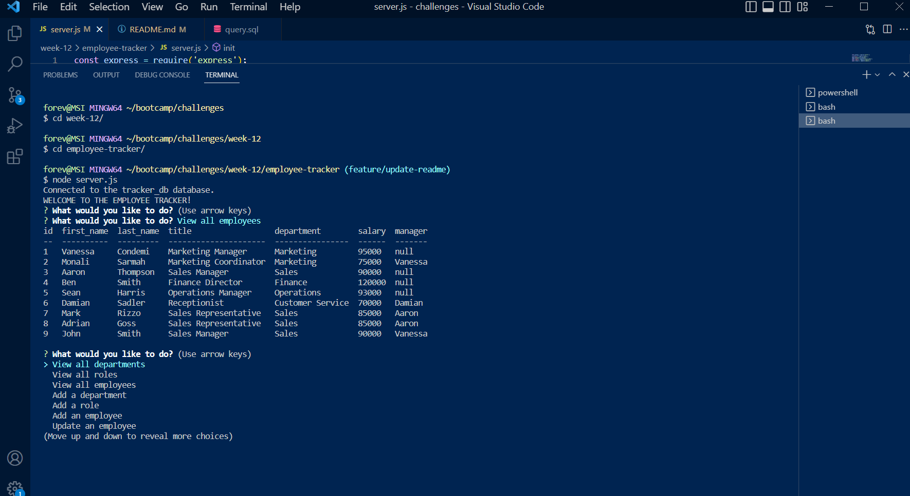
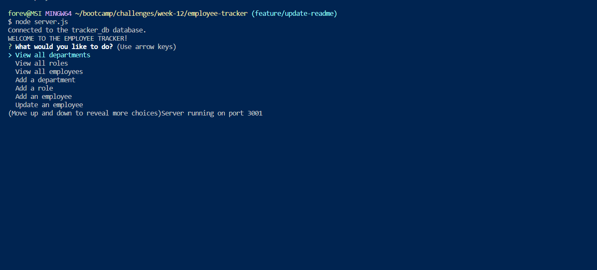

# Week Twelve Challenge: Employee Tracker

## Description

This repository is where I build code to create an app to track, generate and manage an employee database.

## Installation

N/A

## Usage

Run node.js to initiate the Employee Tracker. Answer the user prompts to view, edit or delete the data in the Employee Tracker.

Link to walkthrough video: (https://watch.screencastify.com/v/rk4t8Jlu5KRgaScRonJ5)

## Credits

The following resources were referenced to ensure best practice and adherence to appropriate conventions:

Inquire documentation via npm: (https://www.npmjs.com/package/inquirer) 

MySQL2 documentation via npm: (https://www.npmjs.com/package/mysql2)

Console Table documentation via npm: (https://www.npmjs.com/package/console.table)

mySQL2 promise wrapper documentation via GitHub: (https://github.com/sidorares/node-mysql2/blob/master/documentation/Promise-Wrapper.md)

dotenv documentation via npm: (https://www.npmjs.com/package/dotenv)

MySQL Alias by MySQLTUTORIAL: (https://www.mysqltutorial.org/mysql-alias/)

MySQL Documentation Reference Manual by MySQL: (https://dev.mysql.com/doc/refman/8.0/en/join.html)

SQL Self Join by W3 Schools: (https://www.w3schools.com/sql/sql_join_self.asp)

Common js functions and parameters, for loops and arrays: JS CheatSheet by HTML CheatSheet (https://htmlcheatsheet.com/js/)

## License

Licensed under the standard MIT license. Please refer to the license in the repo for more information.